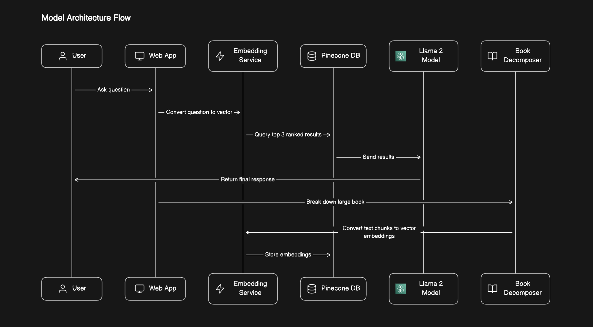

# Medical-Chatbot-Llama-2-7B
This project aims to develop a user-friendly medical chatbot that allows users to query medical information and receive relevant responses efficiently. The chatbot utilizes advanced natural language processing techniques to interpret user queries and provide accurate responses.

# Model Architecture

**Data Collection:** 
A large medical book was downloaded online, and the text was extracted.

**Text Chunking:** 
The extracted text was divided into manageable text chunks for further processing.

**Text Embedding:** 
Text chunks were converted into vector embeddings using MiniLM-L6-v2.

**Vector Database:** 
Vector embeddings were stored in Pinecone Vector Database for efficient retrieval and comparison.

**User Query Processing:** 
When a user submits a query, it is converted into vector embeddings.

**Information Retrieval:** 
The top three ranked results are retrieved from the vector database based on similarity with the user query embeddings.

**Response Generation:** 
The retrieved embeddings are converted back into text, and then passed to the LLAMA-2-7B Chat GGML model for analysis.

**Final Response:** 
The chat model generates the final response based on the analysis of the top three retrieved responses and sends it back to the user.

# Tools Used

**Pinecone:** 
Utilized for storing and querying vector embeddings efficiently.

**Flask:** 
Used for developing the web application interface.

**Hugging Face Transformers:** 
Integrated for leveraging pre-trained language models like MiniLM-L6-v2,LLAMA-2-7B for response generation.

